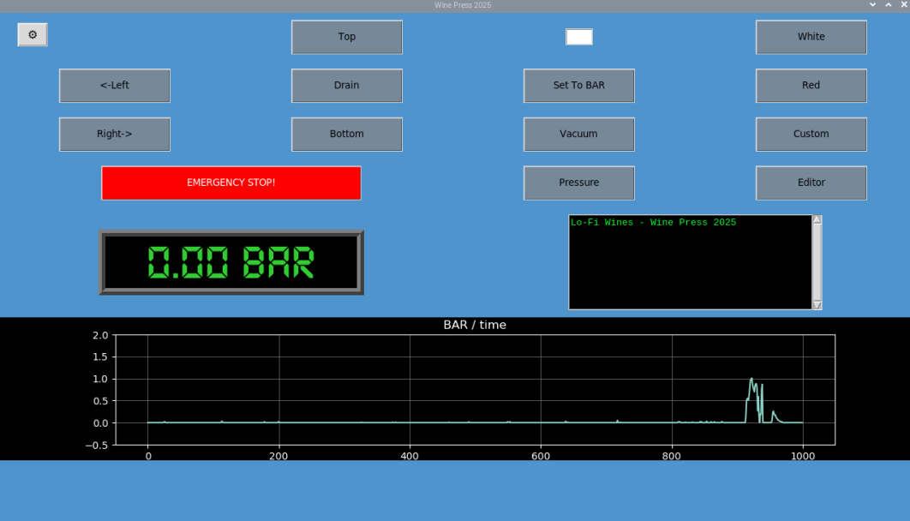

# 🍇 PressPi: Automated Wine Press Control System 🍇

PressPi is a Python-based automation system designed to control a pneumatic wine press using a Raspberry Pi, Arduino (or ESP32), and a set of relays, sensors, and GUI components. It’s built to support both manual and automated pressing cycles with safety features like emergency stop and pressure monitoring.

What started as a pandemic side project to pass the time has recently been completely rewritten, with a help from ChatGPT. I’ll admit it: I’m not a programmer... I’m a winemaker.

old version here: https://github.com/craigwinchester/raspberry-pi-wine-press

I haven’t connected the system to the actual wine press yet — but that’s coming soon. If you’re reading this and have experience with motor controllers and wiring, get in touch. I could use some help in that department. Will pay in wine!

---

## ⚠️ Disclaimer
This software is provided as-is, without any guarantees or warranties. Wine presses are powerful, high-pressure machines and can be dangerous if misused. Over-inflating the bladder, improper wiring, or failure to follow safety protocols could result in equipment damage, injury, or worse.

By using this code, you acknowledge that you do so at your own risk. The author assumes no responsibility for any damage to property or personal injury that may result from using or modifying this system. Always consult a qualified electrician or technician when working with industrial machinery.

---

## Features

- Full GUI built with Tkinter
- Fully editable press cycle programs.   
- Real-time pressure monitoring via ADS1115 & pressure transducer
- Drum position control using bump-detection and timed rotation
- Emergency stop support (software + physical button)  
    > ⚠️ *Still under development – not yet fully functional!*
- Async control loop using `asyncio`
- Web interface (Flask-based) for remote monitoring (optional)

---


*Above: Screenshot of main GUI

---

## Hardware Requirements

- An old wine press! 
        Mine is a 1993 Velo 2100 Liter. We will reuse all it's old motor starters, 12 volt transformer. etc...
- Raspberry Pi (tested with a 4 Model B)
- Arduino Uno or ESP32 (tested with ESP32-S3)  
    > Currently using Arduino for better stability
- ADS1115 analog-to-digital converter
- Pressure transducer (0–30 PSI)  
    > 3-wire, 1/8" NPT  
    > Add 0.1 µF and 10 µF ceramic capacitors to filter noise  
    > Use push-connect pneumatic fittings (6mm)
- Relay board (to control valves, pump, etc. 8 channel)
- OLED screen (optional, 0.96" I2C for local BAR Pressure display)
- Touchscreen (Im using a 7 inch)
- "Bump detector" button for drum position reference. 
    > I'm reusing the original roller plunger limit switch from the press. 
    > Also using a small momentary switch and a resistor for testing with the breadboard.
- 3D-printed mounts and enclosures (see `3d_prints/` directory)  
    > More designs coming soon
- Wires 
- breadboard for testing purposes
- a large Syringe (at least 50ml) plus small hoses to connect to the pressure transducer, to simulate the wine press bladder.

---

## Software Stack

- Python 3.x
- Tkinter
- `pyserial` for serial comms
- `aiofiles`, `asyncio` for async control loop
- Arduino/ESP32 sketch to handle sensor readings & display
- Flask web server for remote monitoring

---

## Development Tools

- VS Code (Python)
- Arduino IDE
- VNC Viewer (for remote Pi access)
- WinSCP or other FTP client
- MU or Thonny on the Pi

---

## System Diagram
More to come!
<details>
<summary>Raspberry Pi to Relay Pin Mapping</summary>

```text
GPIO Pin Mapping
| Raspberry Pi GPIO | Physical Pin | Relay Channel  | Direction |
|-------------------|--------------|----------------|-----------|
| GPIO 17           | Pin 11       | IN1            | LEFT      |
| GPIO 27           | Pin 13       | IN2            | RIGHT     |
| GPIO 22           | Pin 15       | IN3            | *extra    |
| GPIO 23           | Pin 16       | IN4            | DEFLATE   |
| GPIO 24           | Pin 18       | IN5            | DEFLATE   |
| GPIO 25           | Pin 22       | IN6            | DEFLATE   |
| GPIO 16           | Pin 36       | IN7            | INFLATE   |
| GPIO 26           | Pin 37       | IN8            | INFLATE   |

Power and Ground
| Function     | Physical Pin | Description             |
|--------------|--------------|-------------------------|
| 5V Power     | Pin 2        | Connect to Relay VCC    |
| Ground       | Pin 6        | Connect to Relay GND    |

```
</details>
<details>
<summary>Raspberry Pi to Roller Plunger Limit Switch / Button </summary>

```text
GPIO Pin Mapping
| Raspberry Pi GPIO | Physical Pin | button/switch  
|-------------------|------------------------------------|
| GPIO 21           | Pin 40       | side 1       

Power 
| Function     | Physical Pin | Description              |
|--------------|--------------|--------------------------|
| 3.3V Power   | Pin 1        | Connect to side 2 button | 
     *optional: place a 1kΩ or a 10kΩ resistor here in line to button

```
</details>
<details>
<summary>Arduino - ADS1115 - OLED - Pressure Transducer </summary>

```text
This gets a bit confusing...
All these components are conected together, then the Arduino and Raspberry Pi comunicate via USB cable.

Coming soon.

```
</details>

---

## 🗂️ File & Directory Overview

<details>
<summary>Click to expand full file structure and descriptions</summary>

```text
PressPi_2025/
├── main.py                    # Launches the full application (GUI + controller logic)
├── gui.py                     # Tkinter GUI for user interaction
├── controller.py              # Async core logic for press stage sequencing
├── press_logic.py             # Press-specific actions (inflate, hold, rotate, etc.)
├── config.py                  # Centralized configuration values (thresholds, ports, etc.)
├── program.py                 # Press cycle program logic (stage definitions)
├── program_editor.py          # GUI for creating/editing press programs
├── drum_position_editor.py    # GUI tool for calibrating drum position timings
├── relays_off_boot.py         # Optional script to reset all relays on boot
├── sms_alerts.py              # Sends SMS alerts using contact list
├── status.py                  # GUI/status bar updater module
├── utils.py                   # Helper functions (e.g. formatting, time conversion)
├── web_server.py              # Flask web interface (optional for remote monitoring)
├── hardware.py                # Interfaces with GPIO pins and relay logic
├── start_PressPi2025.sh       # Shell script to auto-start the program on boot
├── Press_Pi_2025.desktop      # Desktop shortcut for GUI launch
├── README.md                  # This file – project documentation
├── .gitignore                 # Files/folders excluded from Git tracking
│
├── json_data/                 # Saved configuration and contact data
│   ├── drum_position.json     # Time-based drum position settings
│   ├── email_contacts.json    # Email alert list (if used)
│   ├── programs.json          # User-defined press programs
│   └── sms_contacts.json      # List of phone numbers for SMS alerts
│
├── tmp/                       # Temp folder for logging
│   ├── pressure_history.json  # Rolling pressure history log
│   └── pressure_log.json      # Main pressure log output
│
├── static/                    # Icons, fonts, images
│   ├── FONT/                  # Custom fonts (used in GUI)
│   ├── wine-press.ico         # Application icon
│   └── wine-press.png         # GUI/README image
│
├── Transducer_Arduino/        # Arduino sketches for pressure sensing
│   ├── Transducer.ino                         # Basic serial pressure output
│   ├── Ardunio_Screen_Pressure.ino            # OLED + pressure
│   ├── Ardunio_Screen_Pressure_ADS1115.ino    # OLED + ADS1115 version
│   └── backup_115200.hex                      # Precompiled backup
│
└── __pycache__/               # Python bytecode cache (auto-generated)
```
</details> 

---

## Getting Started
1. Clone the repository:
    ```bash
    git clone https://github.com/craigwinchester/PressPi_2025.git
    cd PressPi_2025
2. Upload the Arduino sketch to the microcontroller.  /Transducer_Arduino/Arduino_Screen_Pressure_ADS1115.ino
3. Make sure the Arduino is connected and recognized on /dev/ttyUSB0 (or update the port in config.py)
4. run the GUI.  python3 main.py.  Or better yet test with Thorny on the pi first.